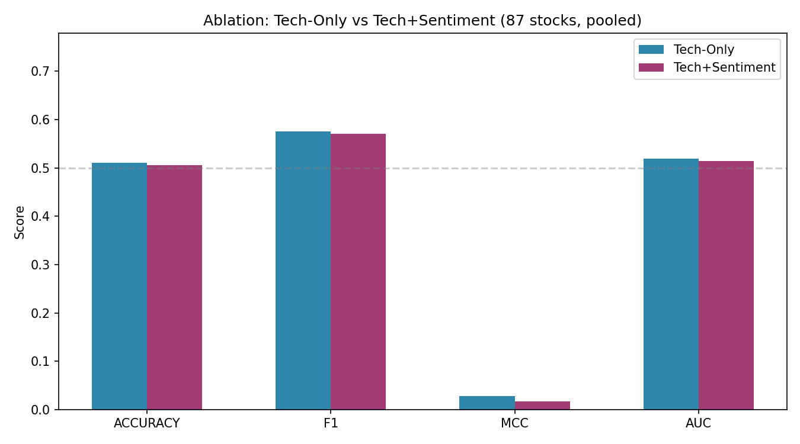
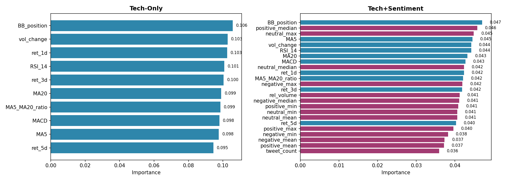
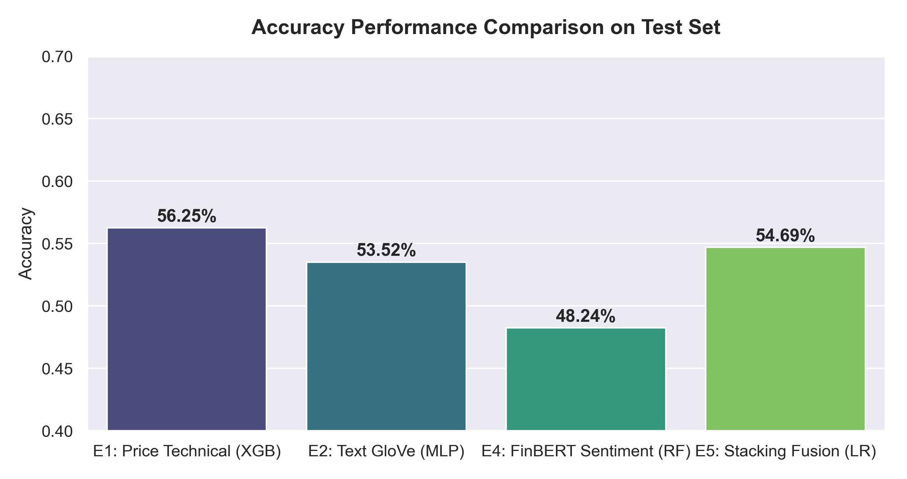
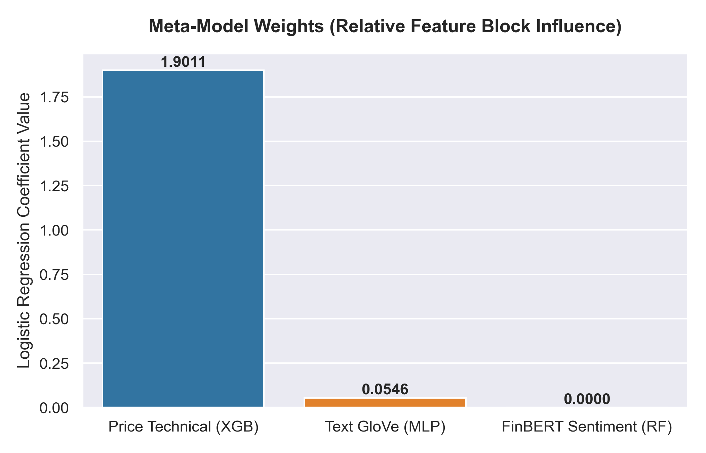
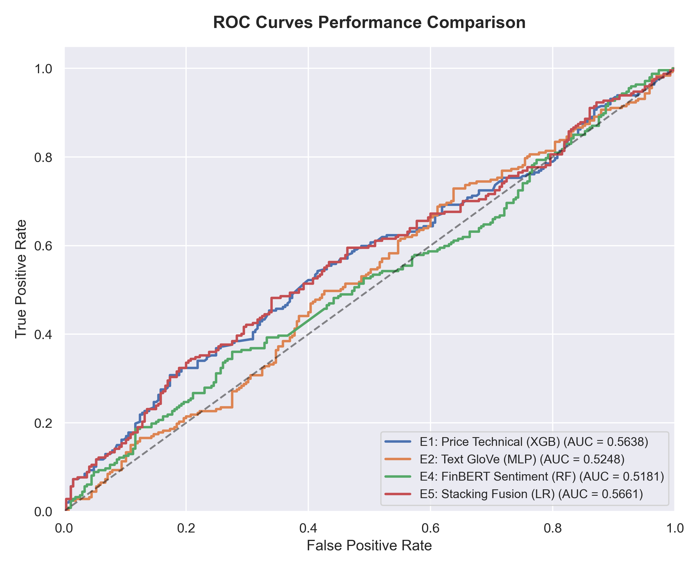

# Stock Movement Prediction with News Sentiment

*Predicting next‑day stock price direction by fusing market technical indicators with Twitter sentiment (FinBERT) and word embeddings (GloVe).*


## Overview

This project asks a simple question: **can social‑media sentiment improve stock‑movement prediction beyond price data alone?**

It builds a full pipeline on the **StockNet dataset** (≈88 US stocks, tweets + OHLCV prices, 2014–2015):

1. Extract daily **sentiment features** from tweets using **FinBERT** (a BERT model fine‑tuned on financial text).
2. Run **ablation studies** comparing *price‑only* vs *price + sentiment* features across two model families (Random Forest and LSTM).
3. Combine everything with a **stacking‑fusion ensemble** that learns how much to trust each signal.

The honest finding (consistent with the literature): sentiment helps **when tweet coverage is high**, and the multi‑signal **stacking ensemble beats any single model** — but stock prediction stays a hard problem near the random baseline.

## Approach

| Signal | Model | Notes |
|--------|-------|-------|
| Price (technical indicators) | XGBoost | OHLCV + engineered features |
| Text (GloVe 300d embeddings) | MLP | 3‑day window of headline embeddings |
| Sentiment (FinBERT scores) | Random Forest | positive / negative / neutral statistics |
| **Fusion** | **Non‑negative Logistic Regression** | meta‑learner over 5‑fold out‑of‑fold predictions |

## Project Structure

```
notebooks/
  00_stockprice_analysis.ipynb      # EDA: price history & sector returns
  01_sentiment_scoring.ipynb        # FinBERT inference -> daily sentiment features
  02_rf_sentiment_ablation.ipynb    # Random Forest: price-only vs +sentiment
  03_lstm_sentiment_ablation.ipynb  # LSTM: OHLCV-only vs +sentiment (sliding windows)
  04_stacking_fusion.ipynb          # Final ensemble (XGBoost + MLP + RF -> meta-learner)
  stacking_fusion.py                # Reusable stacking pipeline imported by notebook 04
  figures/                          # Result figures (stacking stage)
cache/                              # Cached sentiment scores & ablation figures
data/                               # StockNet dataset goes here (not included)
```

## Results

**Ablation — feature sets compared (accuracy / F1 / MCC / AUC):**



**Feature importance — technical vs sentiment features:**



**Stacking fusion — model comparison & meta‑learner weights:**





## How to Run

```bash
pip install pandas numpy scikit-learn xgboost torch transformers matplotlib seaborn
```

1. Place the **StockNet dataset** under `data/` (price + tweet folders).
2. Run the notebooks in numerical order (`00` → `04`).
   - `01_sentiment_scoring` runs FinBERT — much faster on a GPU; results are cached.
   - `04_stacking_fusion` needs GloVe `glove.6B.300d.txt` embeddings.

## Notes

- **Dataset:** StockNet (≈106k tweets after deduplication; ≈43k price records).
- **Sentiment model:** `ProsusAI/finbert`.
- **Reproducibility:** fixed random seed (42); heavy computations are cached to disk.
- Datasets and model weights are intentionally **excluded** from this repository.


---

<sub>📦 Part of my <a href="https://github.com/Nurassyl-labs/ai-ml-portfolio">AI/ML portfolio</a>.</sub>
